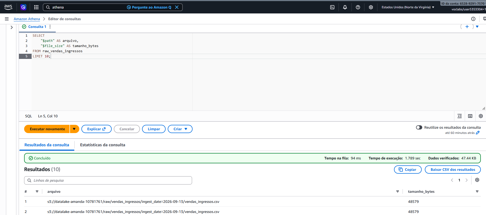
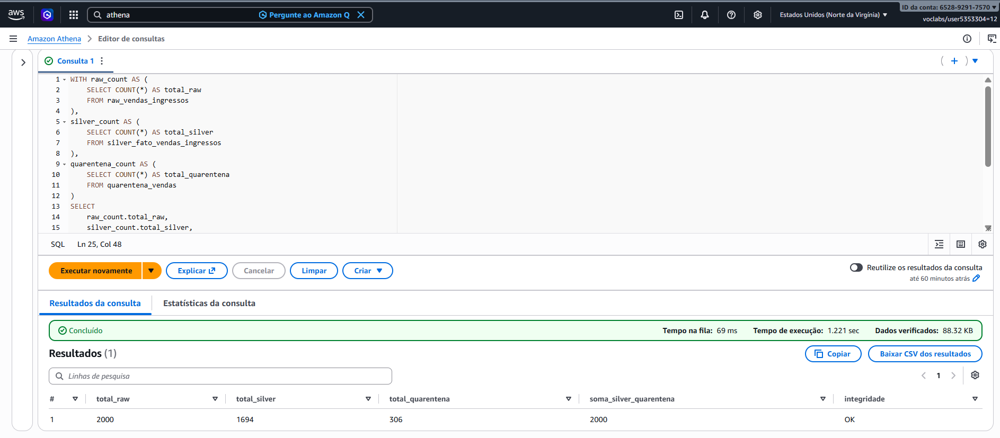

# Atividade 2 - Pipeline Data Lake

## Sobre a atividade

Nesta atividade eu desenvolvi um pipeline de Data Lake para trabalhar com dados de vendas de ingressos utilizando serviços da AWS.

O pipeline foi desenvolvido em Python e executado no Google Colab, utilizando o Amazon S3 para armazenamento dos dados e o Amazon Athena para consulta e validação.

Organizei a estrutura seguindo as camadas Raw, Silver e Gold, além de uma área de quarentena para os registros que apresentaram problemas nas validações.

---

## Tecnologias utilizadas

- Python
- Google Colab
- Amazon S3
- Amazon Athena
- Pandas
- Boto3
- Parquet

As credenciais da AWS foram digitadas via `getpass`, pra não ficarem salvas no notebook nem expostas no repositório.

---

## O que foi feito

O pipeline passa pelas seguintes etapas:

1. Geração dos dados de compradores, eventos e vendas;
2. Inserção de algumas anomalias nos dados de vendas;
3. Ingestão dos dados na camada Raw do S3;
4. Particionamento dos arquivos por data de ingestão;
5. Aplicação das regras de Data Quality;
6. Envio dos registros inválidos para a área de quarentena;
7. Enriquecimento dos dados válidos na camada Silver;
8. Criação da camada Gold com os dados agregados;
9. Criação das tabelas externas no Athena;
10. Registro das partições;
11. Consultas de auditoria e validação.

---

## Dados gerados

Usei:

- **500** compradores;
- **50** eventos;
- **2.000** vendas de ingressos.

Inseri anomalias propositalmente nas vendas pra testar as regras de qualidade dos dados.

Depois das validações:

- **1.694** registros ficaram válidos;
- **306** registros foram para a quarentena.

---

## Regras de Data Quality

As validações aplicadas foram:

- A quantidade de ingressos precisa ser maior que zero;
- O `comprador_id` precisa existir na tabela de compradores;
- O `evento_id` precisa existir na tabela de eventos.

Os registros que não passaram nessas regras foram salvos em formato JSON na área de quarentena, junto com o motivo da rejeição.

---

## Estrutura do Data Lake

A estrutura que criei no Amazon S3 ficou assim:

```text
s3://datalake-amanda-10781761/
│
├── raw/
│   ├── compradores/
│   │   └── ingest_date=2026-09-13/
│   ├── eventos/
│   │   └── ingest_date=2026-09-13/
│   └── vendas_ingressos/
│       └── ingest_date=2026-09-13/
│
├── quarantine/
│   └── vendas_rejeitadas/
│       └── data=2026-09-13/
│
├── processed/
│   └── fato_vendas_ingressos/
│       └── ingest_date=2026-09-13/
│
├── gold/
│   └── vendas_uf_categoria/
│       └── ingest_date=2026-09-13/
│
└── athena-results/
```

### Camada Raw

Os dados originais foram armazenados em formato CSV no S3 e organizados por data de ingestão, usando o padrão de particionamento Hive:

ingest_date=YYYY-MM-DD


### Camada Silver

Na camada Silver usei somente os registros válidos.

Enriqueci os dados de vendas com as informações dos compradores e dos eventos através de JOIN.

Também calculei o campo:

valor_total = quantidade * preco_ingresso


Os dados foram salvos em formato Parquet.

### Camada Gold

Na camada Gold agrupei os dados por estado e categoria do evento.

Calculei as seguintes métricas:

- total de vendas;
- total de ingressos;
- valor total vendido;
- ticket médio.

Os dados também foram salvos em formato Parquet.

---

## Amazon Athena

Criei o banco de dados:

datalake_db_datalake_amanda_10781761


E as seguintes tabelas:

- `raw_compradores`
- `raw_eventos`
- `raw_vendas_ingressos`
- `quarentena_vendas`
- `silver_fato_vendas_ingressos`
- `gold_vendas_uf_categoria`

As partições foram registradas com o comando `MSCK REPAIR TABLE`.

---

## Auditoria no Athena

### Metadados dos arquivos

Para validar os arquivos da camada Raw, usei a consulta com as pseudo-colunas `$path` e `$file_size`:

```sql
SELECT
    "$path" AS arquivo,
    "$file_size" AS tamanho_bytes
FROM raw_vendas_ingressos
LIMIT 10;
```

O resultado mostrou o caminho do arquivo no S3 e o tamanho em bytes de cada um.

Evidência - metadados



### Conciliação dos dados

Também fiz uma consulta pra conferir se a quantidade de registros da Raw batia com a soma dos registros processados na Silver e enviados pra quarentena.

Resultado:

| Camada | Registros |
|---|---|
| Raw | 2.000 |
| Silver | 1.694 |
| Quarentena | 306 |

1.694 + 306 = 2.000


Integridade: OK

Evidência - conciliação



---

## Como executar

1. Abrir o notebook no Google Colab;
2. Configurar as credenciais temporárias da AWS;
3. Informar a região utilizada;
4. Executar as células do notebook em ordem;
5. Conferir a criação dos arquivos e partições no S3;
6. Conferir as tabelas e consultas no Athena.

As credenciais da AWS não fazem parte deste repositório.
